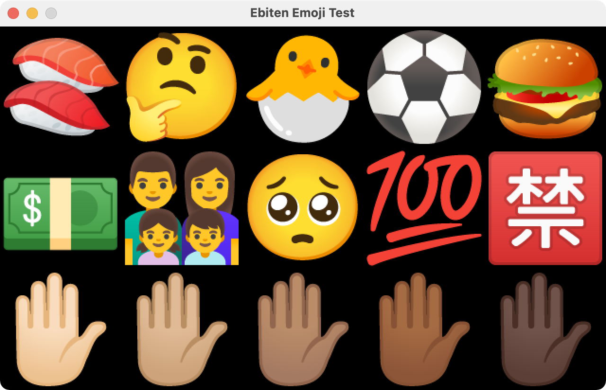

# Ebiten Emoji

**Alpha version: The API is not stable yet**

Package emoji provides Emoji images for Ebiten.



## Usage

```go
func (*YourGame) Draw(screen *ebiten.Image) {
    screen.DrawImage(emoji.Image("🍣"), nil)
}
```
